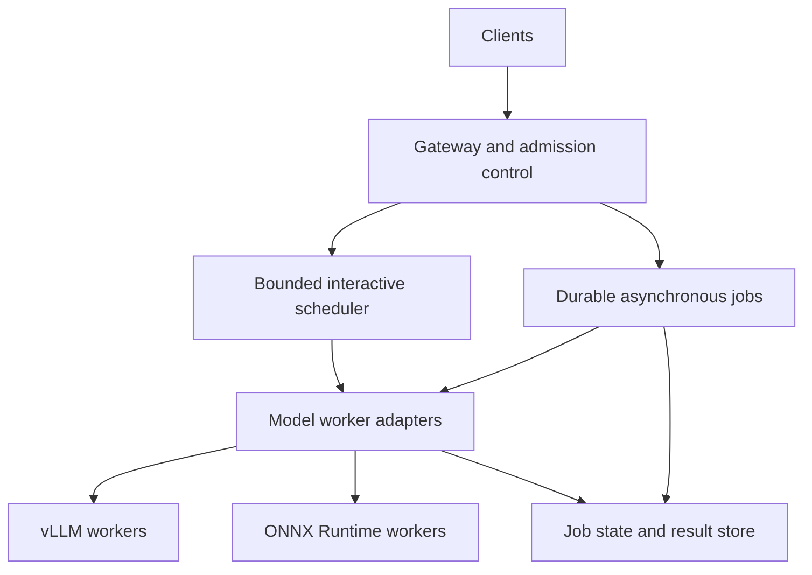

# InferMesh

### A distributed inference gateway for latency-sensitive and asynchronous AI workloads

InferMesh proposes a gateway that routes LLM and vision requests across replicated model workers, controls overload, and makes scheduling decisions measurable. Its central question is: **how much useful throughput can a shared inference service sustain while protecting interactive latency and recovering predictably from worker failures?**

**Status:** Project proposal and implementation plan. This repository currently contains documentation. The gateway, workers, benchmarks, and deployment examples described below are planned; no performance improvements have been measured yet.

**Author:** Abhishek Patil

## At a glance

| Area | Proposed design |
|---|---|
| Request paths | Streaming interactive inference and durable asynchronous jobs |
| Routing | Model-compatible workers, bounded priority queues, health checks, and load-aware dispatch |
| Scheduling | Deadline-aware admission and token-aware estimates for LLM work |
| Model execution | vLLM for LLM serving; ONNX Runtime for a small vision model |
| Reliability | Cancellation, bounded retries, worker draining, and explicit delivery semantics |
| Observability | OpenTelemetry traces and Prometheus metrics for queueing, streaming, and worker utilization |
| Initial implementation | Go gateway and scheduler, Python model adapters, gRPC, and NATS JetStream |

## Contents

- [Problem and intended use](#problem-and-intended-use)
- [Scope and technology decisions](#scope-and-technology-decisions)
- [Proposed architecture](#proposed-architecture)
- [Request lifecycle and API contract](#request-lifecycle-and-api-contract)
- [Scheduling and batching](#scheduling-and-batching)
- [Failure handling and delivery semantics](#failure-handling-and-delivery-semantics)
- [Observability](#observability)
- [Evaluation plan](#evaluation-plan)
- [Implementation milestones](#implementation-milestones)
- [Planned repository structure](#planned-repository-structure)
- [Limitations and references](#limitations-and-references)

## Problem and intended use

A model endpoint can become slow before it becomes unavailable. Long prompts occupy capacity, queued work consumes deadline budgets, and a worker can remain reachable while making little progress. A retry can also duplicate expensive execution or interrupt a partially delivered response.

InferMesh will put those decisions in an explicit control layer. The first demonstration will combine interactive text generation with background vision classification. This creates two workload classes with different latency and delivery needs without requiring a large application around the infrastructure.

The intended outcome is a reproducible systems project: a working gateway, an inspectable scheduling policy, documented failure behavior, and benchmarks that show where each policy helps or hurts. A useful result may reveal that a simpler policy is preferable for a particular workload.

## Scope and technology decisions

**Start with Go for the gateway and Python for model adapters.** Go provides one implementation language for concurrent request handling, gRPC services, queues, and lifecycle management. A Rust component is a later option only if profiling identifies a specific bottleneck. Maintaining two gateway implementations is outside the initial scope.

NATS JetStream is proposed for durable asynchronous delivery. The interactive path will use bounded in-process scheduling queues and direct worker RPCs. Redis is an alternative to evaluate if shared status or coordination becomes necessary; it is not an additional queue dependency in the first version.

The first working system will have one gateway process and multiple workers. This makes worker failover testable without prematurely introducing distributed scheduler coordination. Gateway high availability is a separate milestone requiring durable job metadata and well-defined ownership.

The initial deliverable excludes model training, arbitrary agent execution, global scheduling across regions, automatic GPU autoscaling, and a hosted production service. Kubernetes deployment can follow a reproducible local setup.

## Proposed architecture

| Component | Responsibility |
|---|---|
| Gateway | Validate requests, assign IDs, resolve model versions, enforce limits, and propagate cancellation |
| Scheduler | Select eligible workers and dispatch admitted work within queue and concurrency budgets |
| Worker registry | Track model compatibility, capacity, heartbeats, readiness, and draining state |
| Worker adapter | Translate the internal RPC contract into the model server's actual interface |
| JetStream consumers | Deliver background jobs with explicit acknowledgments and bounded redelivery |
| Job store | Persist submission identity, execution attempts, terminal state, and result references |
| Telemetry layer | Correlate request traces with scheduler decisions, backend activity, and failures |

vLLM exposes an HTTP serving interface; the proposal does not assume it natively implements InferMesh's gRPC contract. A worker adapter will bridge the two and preserve streaming and cancellation behavior. The vision adapter will call ONNX Runtime directly in a controlled worker process.

For the first durable job store, use a local transactional database behind a small interface. A durable submission record and an outbox entry will be committed together, then published to JetStream. This avoids acknowledging a job that exists only in gateway memory. Shared database deployment and multiple publishers can be added after the single-gateway contract is verified.

## Request lifecycle and API contract

The following operations are proposed interfaces, not implemented endpoints:

| Operation | Behavior |
|---|---|
| `Generate` | Stream text events from a specified model and version |
| `Predict` | Return a bounded vision inference result |
| `SubmitJob` | Durably accept asynchronous work and return a job ID |
| `GetJob` | Return queued, running, succeeded, failed, or cancelled status |
| `CancelJob` | Record cancellation and signal an active attempt where possible |

Each request will carry a request ID, model/version, workload class, deadline, and bounded payload. Generation requests will also specify a maximum output-token budget. Asynchronous submissions may include an idempotency key scoped to the caller and request fingerprint; conflicting reuse of a key must be rejected.

1. **Validate:** reject unknown model versions, oversized payloads, unsupported options, and already-expired deadlines.
2. **Admit:** check queue space, concurrency, and estimated model capacity. Overload must produce an explicit response instead of unbounded memory growth.
3. **Route:** consider only compatible, ready workers with fresh health information.
4. **Execute:** propagate the remaining deadline, stream outputs when applicable, and stop queued or active work on cancellation where supported.
5. **Complete:** record outcome, actual usage, and timing. For asynchronous work, persist terminal state before acknowledging the message.

Interactive requests may be lost if the gateway itself crashes. Durable acceptance applies to the asynchronous path only. Recovery tests must reflect this distinction.

## Scheduling and batching

### Establish a simple baseline

Implement round-robin dispatch with fixed per-worker concurrency first. Compare it with least-outstanding-work routing before introducing token estimates. Every policy will use the same worker eligibility rules and backend configuration.

### Token-aware admission

For LLM requests, estimate outstanding work using prompt-token count, requested maximum generation length, and measured worker service rates. Prompt processing and autoregressive generation have different costs, so a single raw token count will be treated as a baseline estimate rather than an exact predictor.

Track estimation error and update estimates from completed requests. Tokenization overhead belongs in the gateway latency budget. A request whose completion time is uncertain must not be advertised as having a guaranteed latency bound.

Use separate interactive and background budgets, plus aging or a reserved service share to prevent starvation. Dispatch policies will be compared under mixed short/long prompts and mixed priority traffic. Queue limits and policy weights will be configuration values frozen before a benchmark comparison.

### Put batching at the correct layer

**LLM continuous batching remains the model server's responsibility.** InferMesh will control admission and worker assignment; it will not attempt to duplicate vLLM's token-iteration scheduler. Any gateway coalescing must justify its added waiting time.

Vision workers may form microbatches of compatible requests up to a maximum batch size or maximum wait. Compatibility includes model version, shape constraints, preprocessing, and execution options. Results must be mapped back to the correct request IDs, and cancelled or expired requests must not retain queue capacity indefinitely.

Batch size, maximum wait, and concurrency will be swept independently. Improved throughput is useful only when the associated latency, timeout rate, and memory use remain visible.

## Failure handling and delivery semantics

| Failure | Intended behavior |
|---|---|
| Worker fails before an interactive response starts | Retry only when the request is replayable, no output has been delivered, and the deadline and retry budget permit |
| Worker fails after streamed tokens are delivered | Report an interrupted stream; do not silently switch workers and append a different generation |
| Worker becomes slow but reachable | Stop new assignments when readiness or capacity checks fail; expire requests by deadline |
| Worker drains for shutdown | Reject new assignments and allow bounded completion of existing work |
| Async worker crashes | Redeliver unacknowledged jobs and resolve execution ownership through persisted attempt state |
| Gateway restarts | Recover durable submissions and outbox entries; interactive connections must reconnect |
| Queue or job store is unavailable | Reject new durable submissions unless they have already been safely committed |

Asynchronous delivery is **at least once**. A job ID, transactional claim, attempt number, and terminal-state check will limit duplicate effects. An expired attempt must not overwrite a newer attempt's result; result publication will use a conditional state transition or equivalent fencing check.

A response can be lost after execution succeeds, so retries may repeat model computation. Idempotency and result reuse are defined within a documented retention window. Neither queue acknowledgments nor deduplication alone establishes exactly-once execution.

Bound retries, apply backoff, and move repeatedly failing jobs to an inspectable terminal state or dead-letter workflow. Separate invalid input and permanent model errors from transient transport failures. Long-running jobs will renew delivery/ownership deadlines so ordinary inference time is not mistaken for a crash.

## Observability

Every request will receive a correlated trace across gateway admission, queue wait, worker dispatch, backend execution, and completion. Prompts and generated content will be excluded from default telemetry. Metric labels will use bounded categories rather than request IDs.

| Measurement | Definition and purpose |
|---|---|
| Time to first token | Client submission to first generated token; include gateway queue time |
| Inter-token latency | Gap between generated token events; distinguish token timestamps from transport chunk timing |
| Queue dwell | Admission to dispatch, separated by workload class and model |
| End-to-end latency | Client submission to terminal outcome, with successful and failed outcomes reported separately |
| Throughput and goodput | Completed work and work completed within the declared service objective per unit time |
| Worker occupancy | Active requests, estimated pending work, and available device utilization measurements |
| Reliability | Timeouts, cancellations, retries, redeliveries, duplicate attempts, and interrupted streams |

If a backend reports chunks containing several tokens without individual timestamps, label the measurement as chunk cadence. Do not present it as exact inter-token latency.

## Evaluation plan

### Workload matrix

- Short and long prompts with bounded short and long generations.
- Interactive-only, asynchronous-only, and mixed-priority traffic.
- Steady arrival rates, bursts, and overload beyond sustainable capacity.
- Uniform workers and deliberately heterogeneous worker capacities.
- Small vision inputs with several compatible batch sizes.
- Worker termination, slow responses, lost acknowledgments, and cancellation during streaming.

Begin with deterministic fake workers to verify routing and failure behavior cheaply. Then run at least one real text model and one real vision model. Record hardware, model revision, precision, input distribution, backend version, batch settings, and concurrency for every real-model result.

### Comparisons

| Experiment | Baseline | Proposed comparison |
|---|---|---|
| Gateway overhead | Direct backend requests | Gateway with equivalent concurrency |
| Worker routing | Round robin | Outstanding-work and token-aware policies |
| Priority handling | Shared FIFO queue | Separate budgets with starvation protection |
| Vision batching | Single-request execution | Size- and wait-bounded microbatching |
| Worker failure | Healthy steady state | Failure injection under the same arrival process |

Use an open-loop load generator that records scheduled arrival times, actual sends, and client bottlenecks. This prevents a slow server from quietly reducing offered load and making tail latency look better. Include warmup separately; repeat trials and report variability rather than selecting the best run.

Report P50/P95/P99 latency, timeout and rejection rates, completed throughput, goodput, and resource use together. Publish the number of observations behind each percentile. Set a workload-specific latency objective before tuning; no universal throughput or P99 improvement is promised in this proposal.

Correctness gates include bounded queue growth, compatible model routing, no silent stream substitution, cancellation cleanup, durable submission recovery, and rejection of stale result publication. Performance work follows those gates.

## Implementation milestones

| Phase | Deliverable | Exit criterion |
|---|---|---|
| 1. Contract and baseline | Go gateway, internal RPC schema, deterministic worker | Single-request and streaming lifecycles work with bounded resources |
| 2. Replicated workers | Registry, round robin, deadlines, cancellation | Two workers route correctly and failure behavior is reproducible |
| 3. Instrumentation | Traces, metrics, open-loop load generator | Queue and execution time can be separated in a benchmark report |
| 4. Real inference | vLLM and ONNX adapters | Text streaming and vision predictions run through the same gateway contract |
| 5. Durable jobs | Job store, outbox, JetStream, attempt fencing | Restart and redelivery tests preserve accepted jobs and terminal-state integrity |
| 6. Scheduling study | Load/token-aware policies and vision microbatching | Controlled comparisons show throughput, latency, and failure tradeoffs |
| 7. Portfolio release | Reproducible configuration, demo, results, limitations | Another developer can reproduce at least one baseline and one failure scenario |

## Planned repository structure

Only this README exists at the proposal stage. The implementation may introduce:

| Path | Planned contents |
|---|---|
| `api/` | Protobuf schemas and request semantics |
| `cmd/gateway/` | Gateway entry point |
| `internal/scheduler/` | Admission, queues, registry, and dispatch policies |
| `internal/jobs/` | Durable submission, outbox, attempts, and result state |
| `workers/` | Fake, vLLM, and ONNX adapters |
| `benchmarks/` | Workloads, load generation, and analysis |
| `deploy/` | Local services and later optional cluster manifests |
| `docs/` | Design decisions, failure contracts, and benchmark reports |

Setup commands will be added when an executable baseline exists. Until then, this document is the project specification.

## Limitations and references

Token estimates can misroute requests, priority policies can starve background work, and tracing can itself add overhead. These are experimental variables. A local multi-worker demonstration does not establish production availability or internet-facing security; authentication, caller quotas, and deployment hardening need explicit implementation before external hosting.

The proposal uses established serving and messaging components. Its contribution is the gateway implementation, the integration of bounded scheduling with explicit failure behavior, and the reproducible evaluation of that design.

- [vLLM: OpenAI-compatible server](https://docs.vllm.ai/en/latest/serving/online_serving/openai_compatible_server/) — model-server interface for the LLM adapter.
- [gRPC: Deadlines](https://grpc.io/docs/guides/deadlines/) — deadline propagation and cancellation considerations.
- [NATS JetStream: Pull consumers](https://docs.nats.io/learn/jetstream/pull-consumers) — bounded consumption and explicit acknowledgment building blocks.
- [ONNX Runtime: Python quick start](https://onnxruntime.ai/docs/get-started/with-python.html) — vision-worker execution interface.
- [NVIDIA Triton: Dynamic batcher](https://docs.nvidia.com/deeplearning/triton-inference-server/user-guide/docs/user_guide/batcher.html) — reference for batching tradeoffs; Triton is not required by the proposed initial stack.
