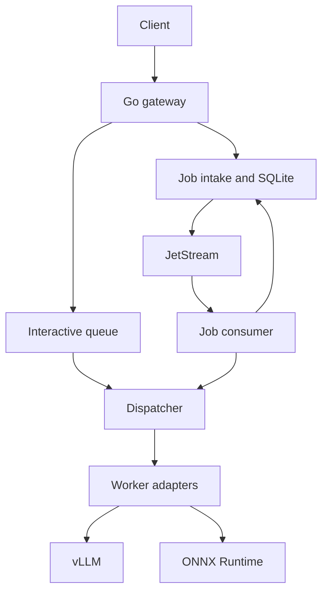

# InferMesh architecture blueprint

**Status:** working local prototype. The sections below describe the target architecture; the README lists implemented behavior and remaining gaps.

## 1. The system in one sentence

InferMesh accepts inference requests, decides whether it has room for them, sends them to a compatible worker, and reports what happened. A separate durable path stores background jobs before execution.

There is **one gateway process** in the first release. The dispatcher, registry, admission logic, job intake, publisher, and consumer are functions or packages in that process, not separate services. Worker adapters are separate processes because they run Python and talk to the model backends. Multiple adapters for the same model make worker failure and routing real. The gateway is a single point of failure for interactive traffic; the durable path recovers accepted jobs after its restart.

## 2. Fixed assumptions and boundaries

- The first public API is HTTP. Text generation streams server-sent events (SSE); vision prediction and job operations return JSON. Internal gateway-to-adapter calls currently use HTTP JSON and newline-delimited JSON streams. This keeps the demo client and adapter code small. A protobuf/gRPC contract remains a possible later change.
- The initial demo is local and has one logical caller. External authentication, multitenancy, per-caller quotas, and public hosting are later work. If callers are added, idempotency keys must be scoped to authenticated caller identities.
- The first text backend is one pinned vLLM model/version; the first vision backend is one pinned ONNX model/version. A configuration file declares which worker serves each model/version. No runtime model discovery.
- The gateway dispatches whole requests. vLLM handles continuous token batching. Vision microbatching is a later experiment inside the vision adapter.
- The gateway process exclusively owns the local SQLite file. SQLite and JetStream storage must use persistent volumes for restart tests. Multiple gateways would require a shared transactional store and a new ownership design.
- Input and stored result sizes are capped. Store small vision results in SQLite. Avoid persisting generated text until a bounded asynchronous text job is explicitly supported.

## 3. The Lego blocks

| Block | One job | Receives | Produces | Owns |
| --- | --- | --- | --- | --- |
| API handler | Decode, validate, set deadlines, encode responses | HTTP request | HTTP JSON or SSE | Request ID and client connection |
| Model catalog | Resolve supported model/version and workload | Config and request | Immutable model configuration | Model definitions |
| Admission | Accept or reject bounded interactive work | Valid request, queue capacity | Queue entry or overload error | Interactive queue limit |
| Registry | Record ready workers and capacity | Config, periodic readiness probe | Eligible worker list | Worker state and active counts |
| Dispatcher | Pick a compatible free worker and issue a worker HTTP call | Queued request or claimed job | Worker stream/result/error | Assignment and concurrency slots |
| Adapter | Make one model backend look like one worker HTTP call | gRPC call | Tokens or prediction | Backend connection and cancellation |
| Job store | Persist accepted jobs and guarded state changes | Submission, attempt, result | Job status | SQLite transaction and job rows |
| Outbox publisher | Deliver committed job IDs to JetStream | Unpublished outbox rows | Persistent queue message | Publication retry |
| Job consumer | Claim delivered jobs, dispatch, persist outcome, ack | JetStream message | Durable result or retry | Message ack and live attempt |
| Measurements | Record bounded timing and error categories | Events from above blocks | Metrics and trace spans | Telemetry names and labels |

**Dependency rule:** API calls admission or job intake; both ultimately call the dispatcher. Dispatcher calls registry and adapter RPC. Job store never calls a model. Adapter does not know SQLite or JetStream. Avoid general-purpose interfaces around single implementations; introduce a policy function only when a second routing policy exists.

## 4. Contracts to freeze before coding

### Public operations

| Operation | Minimal input | Success | Main failure |
| --- | --- | --- | --- |
| `POST /generate` | model, version, prompt, max output tokens, deadline | SSE token events followed by one terminal event | Validation error; overload; interrupted stream |
| `POST /predict` | model, version, bounded image, deadline | JSON prediction | Validation error; overload; worker failure |
| `POST /jobs` | model, version, bounded vision input, optional idempotency key | `202` with job ID | Store unavailable; key conflict; invalid input |
| `GET /jobs/{id}` | job ID | Status and bounded result/error | Unknown ID |
| `POST /jobs/{id}/cancel` | job ID | Current job status | Unknown ID |

For the first durable slice, `SubmitJob` accepts **vision classification only**. Interactive generation demonstrates streaming, and background vision jobs demonstrate durable delivery. Async text generation can reuse job intake later, once result size and retention are specified. Keep internal event names stable: `token`, `completed`, `failed`. Once SSE has sent a token, a worker failure produces `failed`; the gateway never appends tokens from a second worker.

All ingress rejects oversized input, unknown model/version, unsupported options, expired deadlines, and invalid token budgets. The gateway creates a request ID, applies a maximum server deadline, and propagates the *remaining* time to the worker. Client disconnect cancels interactive work. Error responses use a stable code and message; queue full means explicit overload, not an unbounded wait. `GetJob` returns only `queued`, `running`, `succeeded`, `failed`, or `cancelled`.

### Internal worker HTTP contract

| Call | Input | Output |
| --- | --- | --- |
| `Ready` | none | ready flag, configured model/version and capacity |
| `Generate` | request ID, model/version, prompt, max tokens, deadline | Stream of token events and terminal outcome |
| `Predict` | request ID, model/version, bounded image, deadline | One prediction or error |

The vLLM adapter converts `Generate` to its HTTP streaming API. The ONNX adapter implements `Predict` within its process. Gateway request cancellation closes the backend HTTP request where supported. A worker reports a maximum number of concurrent calls; the gateway enforces it. Every worker must be explicitly configured for a model/version; a ready worker for another version is never eligible.

## 5. Interactive path

1. API validates the request and applies a deadline.
2. Admission limits the number of interactive requests waiting for a worker slot or rejects immediately when that limit is full. Vision and generation can initially share this queue; measure queue dwell per workload.
3. Dispatcher removes an entry, drops it if cancelled/expired, picks the next compatible ready worker with a free slot, and starts the RPC. Start with round robin among eligible workers. Waiting requests currently poll for a free slot; strict FIFO ordering is not implemented.
4. Adapter returns a prediction or text events. Gateway forwards text as it arrives. Completion releases the worker slot.
5. If the worker fails **before any text is delivered**, one retry on a different eligible worker is allowed only while the deadline has time left. The simplest initial version can set this retry budget to zero; introduce a retry after the no-retry path is verified. Once text was delivered, report an interruption.

**No latency guarantee:** a queue position and a token budget are insufficient to guarantee completion time. Deadline expiry ends work; it is not a prediction that admitted work will finish.

## 6. Durable job path

The job path exists to establish one precise claim: after a successful `202` response, a gateway restart does not lose the accepted job. JetStream alone cannot safely provide that claim if the gateway acknowledges before publishing.

**SQLite tables (conceptual):** `jobs` stores ID, request fingerprint, bounded input, status, result, current attempt, lease expiry, timestamps, and idempotency key. `outbox` stores job ID and publish status. A unique constraint on the idempotency key (single logical caller in the local demo) resolves concurrent duplicate submissions.

1. `POST /jobs` opens a SQLite transaction, inserts `jobs(status=queued)` and an `outbox(job_id)` row, commits, then responds `202`. On a repeated idempotency key with the same canonical request fingerprint, return the original ID; with a different fingerprint, reject the conflict. A missing key creates a new job.
2. Publisher reads unpublished outbox rows, publishes a message containing **only the job ID** to JetStream, waits for a confirmed publish, then marks the outbox row published. A crash may publish the same ID twice, which the consumer handles. On restart, publisher scans remaining rows again.
3. Consumer takes a message only when background worker capacity is available. It reads the job. Terminal or cancelled jobs are acknowledged without execution. Otherwise it claims a queued job, or a running job whose lease expired, by a conditional SQLite update that increments its attempt number.
4. Consumer dispatches the input using the same registry and dispatcher rules as the interactive path. While work runs, it extends its lease if needed. The active attempt is identified by `(job_id, attempt_number)`.
5. On success, a transaction changes `running` to `succeeded` and stores the bounded result **only if the attempt number still matches and the job was not cancelled**. Only after the durable update does the consumer acknowledge the message. A stale attempt cannot overwrite a newer result.
6. On transient failure, release/retry with bounded backoff and a maximum attempt count. On invalid input or permanent backend error, persist `failed`, then acknowledge. A terminal attempt cap prevents infinite redelivery. A message for a currently leased job is deferred until the lease expires or status becomes terminal.
7. `CancelJob` atomically changes queued/running work to `cancelled` and signals the in-process attempt if present. A late worker result fails the conditional update. Cancellation is best effort at the backend but final job state is fenced.

**Critical recovery check:** retry submissions after a lost `202`, restart before publishing, restart after publishing before marking outbox, restart after worker success before acknowledgment, and allow an old attempt to finish after a new attempt claimed the job. Expected behavior is one logical job status; model computation may occur more than once. This design offers at-least-once execution, never exactly-once model execution.

## 7. Capacity and policy: one experiment at a time

Start with fixed per-worker concurrency, a fixed queue length, and round robin among compatible available workers. If every eligible worker is busy, work waits only while its queue slot and deadline allow. Registry marks a worker unavailable after failed readiness checks; a periodic `Ready` call and worker call failure are enough initially. Do not build a heartbeat service or distributed registry.

For mixed traffic, each worker has one slot for background jobs and the remaining slots for interactive work. These slots are not borrowed across classes; the gateway requires a configured per-worker capacity of at least two when jobs are enabled. Compare fixed reservations with a shared pool later if utilization warrants it. Capacity config must have enough slots for both classes when both are enabled.

Only after the baseline is measured, swap the **selection function** while keeping eligibility, queue size, workload, and backend identical: round robin → least active calls → estimated pending token work (the first two exist; the last remains planned). Estimate prompt and generation costs separately; record prediction error. Do not implement a custom LLM batcher. Vision batching is an independent adapter experiment: start with batch size one, then add compatible batches with size and wait caps and an ID-to-result mapping.

## 8. Measurements and demo proof

Record arrival time, admission result, queue entry, dispatch, first streamed event, and completion. Expose queue depth, active calls, rejection, timeout, retry, redelivery, and outcome counts with bounded model/workload labels. Do not put prompts, images, job IDs, or request IDs in metric labels or default traces.

The small load generator uses scheduled arrival times (open loop), records actual send times and completions, and fails loudly if the client itself cannot meet its schedule. First benchmark a deterministic fake worker and report p50/p95/p99 with counts, throughput, goodput against a predeclared latency target, timeouts, and rejections. Compare direct backend versus gateway at matched concurrency. A second report can use pinned real models and record hardware, model revision, precision, versions, and workload. Never claim a measured improvement before running and publishing that comparison.

Demo sequence: two fake workers answer both compatible requests; kill one and show new traffic goes to the survivor; interrupt an active text stream and show an error without switched output; submit a vision job, restart the gateway, and show the same job ID reaches a terminal state; inject duplicate delivery and show stale attempt fencing. Run the real model adapters as a separate demonstration when the hardware allows it.

## 9. Build order with small exit checks

| Slice | Add only | Check before moving on |
| --- | --- | --- |
| 1. Contract | Request shapes, model config, fake adapter | One text stream and one vision prediction have clear success/error endings |
| 2. Gateway | HTTP handlers, direct worker HTTP calls, deadlines | Fake worker handles both paths; cancellation stops a call |
| 3. Routing | Two fake workers, registry, bounded queue, round robin | Wrong model never routes; overload rejects; kill one worker and recover |
| 4. Timing | Queue and worker timing, simple open-loop generator | Offered load and actual send rate are both visible |
| 5. Real models | vLLM and ONNX adapters | Both real paths work through the existing contract |
| 6. Job persistence | SQLite job intake, status, cancellation, outbox | `202` survives restart before any message is published |
| 7. Delivery | JetStream publisher and consumer, leases, attempt fencing | Duplicates and crashes cannot overwrite terminal state |
| 8. Comparison | Alternative selector, then vision batcher if justified | Same workload and limits; show latency, goodput, failures, resources |
| 9. Release | Local startup, demo script, results, limitations | Another developer can repeat a baseline and a failure test |

Each slice should leave a runnable system. Do not create all planned directories and interfaces in slice 1. Grow the code only when the next slice needs it.

## 10. Repository layout when those blocks exist

| Path | Contents |
| --- | --- |
| `api/` | HTTP contract examples if later needed |
| `cmd/gateway/` | Process wiring and configuration |
| `internal/serve/` | HTTP validation and streaming |
| `internal/dispatch/` | Queue, registry, routing, worker slots |
| `internal/jobs/` | SQLite store, outbox, consumer and fencing |
| `workers/fake/` | Deterministic worker |
| `workers/vllm/`, `workers/vision/` | Python adapters |
| `benchmarks/` | Load generator and recorded workload definitions |
| `deploy/` | Local compose setup when external services are added |
| `docs/` | Failure contract, architecture, benchmark results |

## 11. Deliberate limits

Single gateway; SQLite on its persistent volume; local trusted caller; no exactly-once model execution; no gateway high availability; no autoscaling; no custom text batching; no speculative policy framework. Those limits define a testable portfolio project. Expand a limit only after the associated failure or measurement makes the cost worthwhile.
